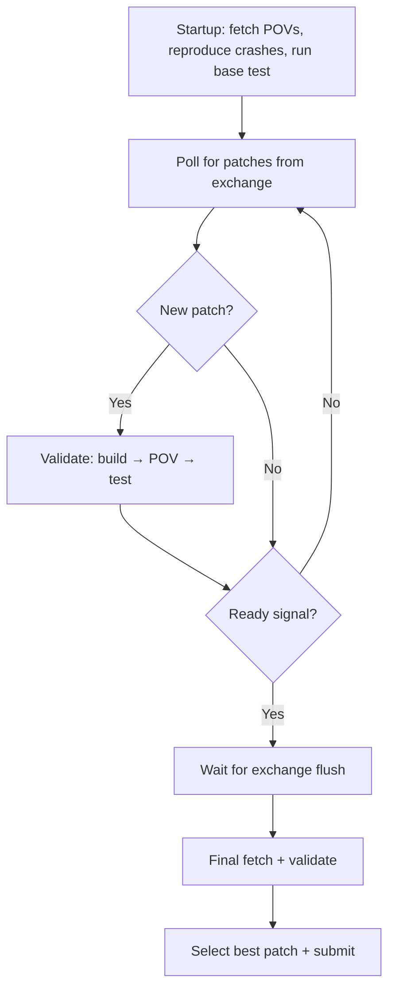

# crs-patch-ensemble

Patch ensemble CRS for OSS-CRS. Collects patches from other bug-fixing CRSes, validates each (build + POV + test), and uses Claude Code to select the best fix when multiple candidates pass.

## Interface

The ensemble CRS interacts with the framework through two channels:

- **Patch monitoring** — Polls the exchange directory (`OSS_CRS_FETCH_DIR`) for patches submitted by other bug-fixing CRSes
- **Ready signal** — Expects `$OSS_CRS_FETCH_DIR/status/ready` to appear when all patch CRSes have exited, signaling that no more patches will arrive and ensemble selection should begin (currently provided by the lifecycle sidecar in oss-crs-infra)

## How it works



## Ensemble strategy

Currently implements **must-select**: when all patch CRSes have finished, the ensemble selects exactly one patch from all validated candidates and submits it.

- **1 candidate** — auto-select
- **2+ candidates** — Claude Code evaluates each patch against the crash logs and source code, selecting the one that best addresses the root cause rather than just the symptom. Falls back to first candidate on selector failure
- **0 candidates** — nothing to submit

## Usage

```yaml
patch-crs-a:
  cpuset: "4-11"
  memory: "16G"
  additional_env:
    ANTHROPIC_MODEL: claude-sonnet-4-6

patch-crs-b:
  cpuset: "12-19"
  memory: "16G"

# Ensemble CRS
crs-patch-ensemble:
  source:
    local_path: /path/to/crs-patch-ensemble
  cpuset: "20-23"
  memory: "8G"
  llm_budget: 10
  additional_env:
    ANTHROPIC_MODEL: claude-sonnet-4-6

# LLM required for Claude Code selector
llm_config:
  litellm:
    mode: internal
    internal:
      config_path: ./litellm-config.yaml
```

Requirements:
- At least one other bug-fixing CRS in the compose
- Exchange enabled (automatic when multiple CRSes are present)
- LLM config for the Claude Code selector


## Environment variables

| Variable | Default | Description |
|----------|---------|-------------|
| `BUILDER_MODULE` | `inc-builder-asan` | Builder sidecar module name |
| `POLL_INTERVAL` | `5` | Seconds between fetch cycles |
| `SUBMISSION_FLUSH_WAIT_SECS` | `12` | Wait for exchange flush after ready signal |
| `SELECTOR_MODEL` | _(from ANTHROPIC_MODEL)_ | Model for Claude Code selector |
| `SELECTOR_TIMEOUT` | `0` (unlimited) | Selector timeout in seconds |

## File structure

```
crs-patch-ensemble/
├── oss-crs/
│   ├── crs.yaml              # CRS config (type: bug-fixing-ensemble)
│   ├── docker-bake.hcl       # Build config
│   ├── base.Dockerfile       # Ubuntu + Python + Node.js + Claude Code CLI
│   ├── builder.Dockerfile    # Target builder
│   └── patcher.Dockerfile    # Patcher container
├── patcher.py                # Core logic
├── bin/compile_target        # Build script
└── pyproject.toml            # Python dependencies
```
